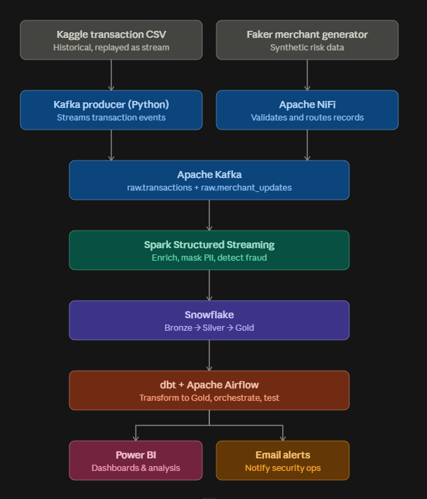

# FinShield — Real-Time Fraud Detection & Governance Pipeline

## 🚧 Status
Complete — all phases (EDA, ingestion, streaming enrichment, PII masking,
fraud detection, dbt Gold modeling, Airflow orchestration + alerting,
Power BI dashboard) implemented and validated end-to-end.

## Overview
A real-time financial transaction processing pipeline that streams credit card
transactions, enriches them with merchant risk data, detects fraud patterns,
masks PII, and stores results in a Medallion Architecture (Bronze → Silver →
Gold) on Snowflake, visualized in Power BI.

## Architecture


```
Kaggle CSV → Kafka → PySpark Structured Streaming → Snowflake (Bronze/Silver)
Faker merchant risk data → NiFi → Kafka → (joined into Spark stream)
Snowflake Silver → Airflow + dbt → Snowflake Gold → Power BI
Airflow (hourly) → Gold suspicious-activity check → Email alert to security ops
```

## Tech Stack
| Tool | Role |
|---|---|
| Python | Data streaming producer, EDA |
| Apache Kafka | Event streaming backbone |
| Apache NiFi | Secondary source ingestion (merchant risk feed) |
| PySpark (Structured Streaming) | Real-time enrichment, PII masking, fraud detection |
| Snowflake | Medallion-architecture data warehouse |
| dbt | Silver → Gold transformations, testing |
| Apache Airflow |  Orchestration (dbt run/test) + automated fraud-alert email notifications 
| Power BI | Fraud analytics dashboard |

## Dataset
- **Transactions**: [Credit Card Transactions Fraud Detection Dataset](https://www.kaggle.com/datasets/kartik2112/fraud-detection) (Kaggle, simulated but realistic, includes ground-truth fraud labels)
- **Merchant risk scores**: synthetically generated via Faker, streamed through NiFi

*(See `data_provenance.md` for full details on what's real vs. simulated.)*

## Key Findings
## Key Findings
- Dataset verified clean: 0 nulls, 0 duplicates across 1.85M rows (train + test).
- Fraud is highly imbalanced: 0.58% of transactions are fraudulent.
- Fraudulent transactions average $531 vs. $68 for legitimate ones (~8x higher).
- Transaction amount is the strongest single detection signal: transactions
  flagged as high-amount show a 7-11% real fraud rate — roughly 70-90x the
  ~0.1-0.2% baseline rate for unflagged transactions.
- Fraud rate increases with customer age group (18-25 lowest, 65+ highest).
- Merchant risk_score (synthetic/Faker-generated) shows no meaningful
  correlation with real fraud, as expected for demo reference data —
  see Design Decisions.
- Model validation (held-out fraudTest.csv): Precision 8.87%, Recall 64.84%
  — reflects a recall-prioritized threshold; see Design Decisions for the
  precision/recall trade-off rationale.

## How to Run
## How to Run
1. Set up `.env` (see `.env.example`) with Snowflake credentials.
2. Run `snowflake/ddl_setup.sql` once in a Snowflake worksheet.
3. Start Kafka, create topics: `raw.transactions`, `raw.merchant_updates`.
4. Start NiFi flow (GetFile → ValidateRecord → PublishKafka).
5. Run `python faker_source/generate_merchants.py`.
6. Run `python producer/stream_transactions.py`.
7. Run `spark-submit spark_jobs/streaming_job.py` (see script for required `--packages`).
8. `docker compose up` to start Airflow; unpause`dbt_pipeline_dag & email_alert_dag`in the UI.
9. Open Power BI report, connect to Snowflake Gold, refresh.

## Design Decisions
## Design Decisions
- **Stream-static join over stream-stream**: merchant reference data
  changes far less frequently than transactions, so a periodically-refreshed
  static join avoids the complexity of watermarked stream-stream joins
  while matching the real update cadence of the data.
- **SHA-256 hashing (not encryption) for card numbers**: preserves the
  ability to detect per-card patterns (velocity) without storing or
  exposing the original value. Unsalted for this demo, since the
  underlying data is a public, already-anonymized dataset rather than
  real customer data — production use would add a secret salt.
- **age_group derived before masking dob**: retains age-based analytical
  value without exposing exact birthdates downstream.
- **Velocity computed per micro-batch, not true rolling window**: a
  simplification versus a full stream-stream watermarked window; combined-signal
  analysis shows this proxy adds limited standalone predictive value
  compared to the amount signal — a documented, known limitation.
- **Recall-prioritized detection threshold**: current threshold (risk
  score ≥ 50) favors catching more real fraud over minimizing false
  positives, reflecting that missed fraud is typically costlier than a
  false alarm. A production system would tune this against real cost data.
- **Automated email alerting via Airflow**: an hourly DAG queries Gold for
  recently flagged high-risk transactions and emails a summary to
  security operations when volume exceeds a threshold — closing the loop
  from detection to actionable notification, not just passive dashboarding.
- **Batch-simulated streaming**: transaction data originates from a static
  historical dataset, replayed through Kafka to simulate a live feed;
  processing from Kafka onward is genuine streaming architecture.


